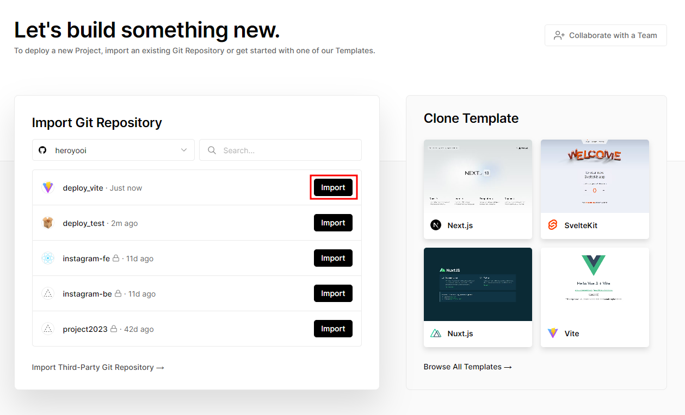
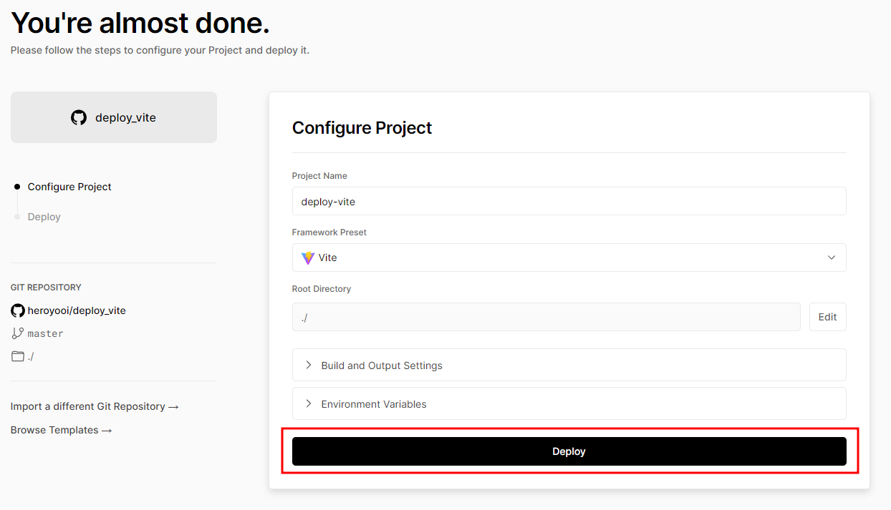
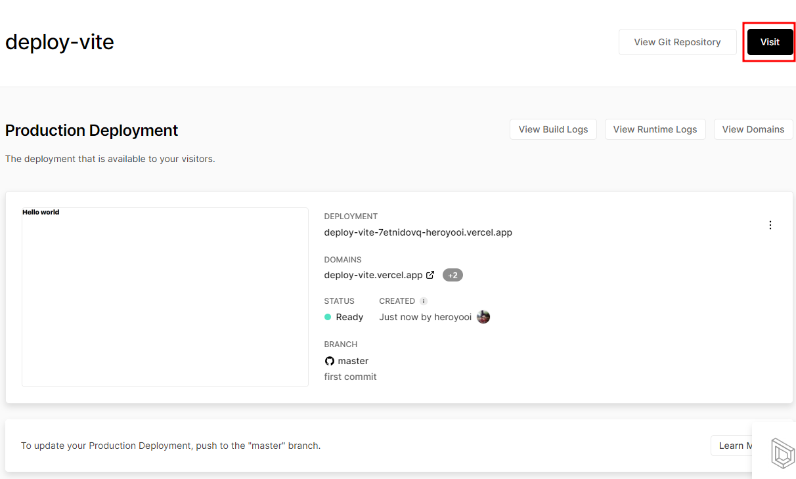

# Deploy test

- 클라우드 서비스를 통해 배포하는 과정을 공부하기 위해 만들어진 저장소입니다.
- [Vite 배포 관련 저장소](https://github.com/heroyooi/deploy_vite)

## Netlify

- [Netlify - 배포 테스트를 위한 프로젝트 URL](https://app.netlify.com/sites/vocal-alfajores-b8e246/overview)

---

## Vercel

- index.js 파일 작성
```js
const fs = require('fs');
fs.mkdirSync("dist");
fs.writeFileSync(
  "dist/index.html", 
  `
  <html>
    <body>
      <h1>hello, world</h1>
      <p>I am Yeonwook</p>
    </body>
  </html>
`
);
```
- Vercel로 배포

- [Vercel로 배포한 URL](https://deploy-test-navk.vercel.app/)

---

## Parcel

    npm install --save-dev parcel

---

## Vite

    npm create vite@latest

- [Vite - Getting Started](https://vitejs.dev/guide/)

### Tailwindcss

    npm install -D tailwindcss postcss autoprefixer
    npx tailwindcss init -p

- [Tailwind css - Framework Guides](https://tailwindcss.com/docs/installation/framework-guides)
- [Tailwind css - Framework Guides - Vite](https://tailwindcss.com/docs/guides/vite)

- **tailwind.config.js** 작성
```js
/** @type {import('tailwindcss').Config} */
export default {
  content: [
    "./index.html",
    "./src/**/*.{js,ts,jsx,tsx}",
  ],
  theme: {
    extend: {},
  },
  plugins: [],
}
```

- **index.css** 작성

```css
@tailwind base;
@tailwind components;
@tailwind utilities;
```

- **main.ts** 가장 상단에 작성

```ts
import './index.css'
```

### Vercel에 배포

- [Vercel - 배포할 목록](https://vercel.com/new)





- [Vercel - 배포한 URL](https://deploy-vite.vercel.app/)